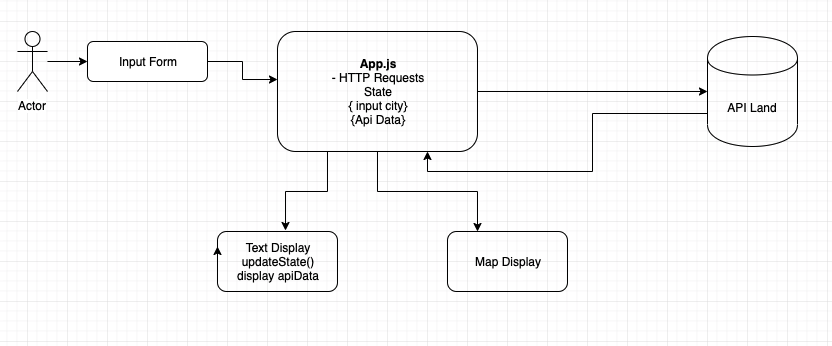

# City Explorer

**Author**: Ian Cargill\
**Version**: 1.0.0

## Overview

A site for city exploration. Enter a city to see what it has to offer.

## Getting Started

Built with create React App.

- npm start\
  This will fire up your local devlopment server

- npm build\
  Bundled for deployment

## Architecture

Site deployed on Netlify [here](https://explore-this.netlify.app/)

Built with [Create React App](https://create-react-app.dev/) and [React-Bootstrap](https://react-bootstrap.github.io/).
API requests are handled with the [axios](https://axios-http.com/) library.

## Change Log

10-6-2021 10:00pm Weather timestamp / data alignment
10-6-2021 10:30pm Error Handling uploaded\
10-5-2021 9:30pm inital setup.

## Credit and Collaborations

I would like to thank the internet.

## Added Features

### Build Form and Display API Data

Estimate of time needed to complete: 1 hour\
Start time: 10:00pm\
Finish time: 11:00pm\
Actual time needed to complete: 1 hour

### Display Map

Estimate of time needed to complete: 1 hour\
Start time: 6:45pm\
Finish time:8:45pm\
Actual time needed to complete: 2hrs\
(map/image/documenation)

### Error Message

Estimate of time needed to complete: 1 hour\
Start time: 9:40pm\
Finish time: 10:10pm\
Actual time needed to complete: 30 min

### Display Timestamp

Estimate of time needed to complete: 1 hour\
Start time: 9:00pm\
Finish time: 9:30pm\
Actual time needed to complete: 30 min
